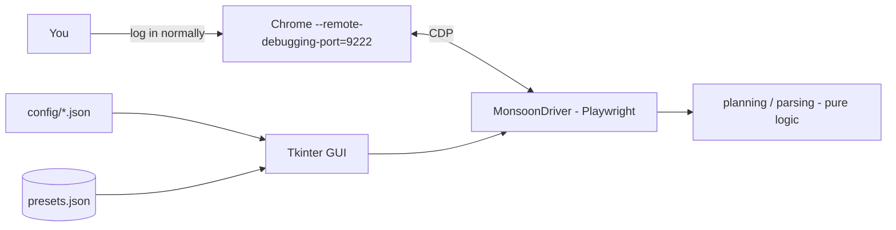

# MonsoonSim Bot

[](https://github.com/XDefoeRedstoneX/monsoonsim-bot/actions/workflows/ci.yml)
[](https://www.python.org/)
[](LICENSE)

A desktop automation tool for **[MonsoonSim](https://monsoonsim.com/)**, the
multiplayer business-simulation platform used in universities and corporate
training. It attaches to your *already-running, logged-in* browser session and
takes over the repetitive day-to-day operations — retail replenishment and
service/HR manday assignment — so you can focus on strategy instead of clicking.

As far as I can tell, it's one of the first publicly available automation tools
built specifically for MonsoonSim. It started as an AutoHotkey macro and has
since grown into a proper Playwright-driven application.

> ⚠️ **Read the [disclaimer](#%EF%B8%8F-disclaimer) first.** This is an
> educational/research project. Automating a simulation may conflict with your
> institution's rules or MonsoonSim's terms of service. Use it only where you
> are permitted to.

---

## Demo

> 📸 _Screenshots / GIF go here_ — add `docs/screenshot.png` and a short capture
> of the Retail AI tab running a replenishment loop.

---

## ✨ Features

- **Retail replenishment AI** — reads each store's space utilisation and current
  stock, then computes space-aware orders that hit a configurable fill target
  (100%–160%), with optional per-product prioritisation (60/40 space split).
- **Dry-run calculator** — preview exactly what would be ordered before
  committing a single click.
- **Service / HR automation** — opens the first incoming service request and
  auto-assigns the required mandays across Marketing / Franchise / Technical.
- **Full-automation loop** — runs service + retail every in-game day and waits
  intelligently for the day counter to advance.
- **Per-location priority presets** — saved to disk and remembered across
  restarts (and kept separate per product set).
- **Built-in self-test** — one click verifies the connection and that the key
  parts of the game UI can be read, so failures are diagnosable.
- **Five product sets & two regions** out of the box (Juice, Mask, Car, Coffee,
  Electronics × Indonesia, China), all defined in editable JSON.
- **Rate-limit aware** — detects MonsoonSim's "slow down" notice and retries
  with backoff.

---

## 🏗️ How it works

The bot does **not** log in or control the game directly. You log in normally in
Chrome (started in remote-debugging mode); the bot attaches to that tab over the
Chrome DevTools Protocol and scripts it with Playwright.



The codebase is deliberately layered so the business logic is testable without a
browser:

| Module | Responsibility | Browser? |
| --- | --- | --- |
| `monsoon_bot/products.py` | Product / location data models | No |
| `monsoon_bot/planning.py` | Replenishment order maths | No |
| `monsoon_bot/parsing.py` | Parsing values scraped from the DOM | No |
| `monsoon_bot/selectors.py` | Centralised CSS/XPath selectors | No |
| `monsoon_bot/driver.py` | Playwright engine (`MonsoonDriver`) | **Yes** |
| `monsoon_bot/app.py` | Tkinter GUI | **Yes** |

Because the math and parsing are pure functions, the whole replenishment
algorithm is covered by unit tests that run in CI with no game session.

---

## 🧰 Tech stack

Python 3.10+ · [Playwright](https://playwright.dev/python/) · Tkinter ·
asyncio · pytest · ruff · GitHub Actions

---

## 🚀 Getting started

### 1. Prerequisites

- Python **3.10+**
- Google Chrome (or Chromium)
- A MonsoonSim account with an active simulation

### 2. Install

```bash
git clone https://github.com/XDefoeRedstoneX/monsoonsim-bot.git
cd monsoonsim-bot
pip install -r requirements.txt
playwright install chromium   # one-time browser download for Playwright
```

### 3. Launch Chrome in remote-debugging mode

Close all running Chrome windows first, then start it with the debugging port.
Pick your OS:

**Windows**
```powershell
& "C:\Program Files\Google\Chrome\Application\chrome.exe" --remote-debugging-port=9222 --user-data-dir="%TEMP%\monsoon-chrome"
```

**macOS**
```bash
/Applications/Google\ Chrome.app/Contents/MacOS/Google\ Chrome --remote-debugging-port=9222 --user-data-dir="$HOME/monsoon-chrome"
```

**Linux**
```bash
google-chrome --remote-debugging-port=9222 --user-data-dir="$HOME/monsoon-chrome"
```

> The `--user-data-dir` flag uses a fresh profile so it won't clash with your
> everyday Chrome. In that window, log in to MonsoonSim and open your simulation.

### 4. Run the bot

```bash
python -m monsoon_bot
# or:  python app.py
```

Then in the GUI:

1. Click **Connect to Browser** — it finds your MonsoonSim tab automatically.
2. Click **Run Self-Test** to confirm everything is readable.
3. Pick your **Product Set** and **Location Set** under Global Settings.
4. On the **Retail AI** tab, **Fetch Locations**, choose a target fill level,
   tick any priority products, and hit **Calculate Order** (dry run) or
   **Run One-Time Replenish**.
5. Use the automation loops (Retail / Service / **Full Automation**) to run
   hands-free each in-game day.

---

## ⚙️ Configuration

All game content lives in `config/` and can be edited without touching code:

- **`config/products.json`** — product sets: each product's in-game form code
  and per-unit space, plus the valid order quantities.
- **`config/locations.json`** — region → `{location name: in-game id}`.
- **`config/settings.json`** — debug-port URL, site match fragments, default
  vendor, fill-level options, retry/timeout tuning.

If MonsoonSim changes its front-end, the DOM selectors are all in one place:
`monsoon_bot/selectors.py`.

### The replenishment algorithm

For each location the planner:

1. Reads space utilisation (`used / total m²`) and current stock per product.
2. Turns the **target fill %** into a target m² to occupy.
3. Splits that space into per-product **quotas** (even, or 60/40 when products
   are prioritised).
4. For each product, fills the gap between its quota and its current footprint,
   choosing the **largest valid order quantity** that fits.
5. **Caps** the combined order so it never exceeds the physically remaining
   space.

---

## 🧪 Development & testing

```bash
pip install -r requirements.txt
pytest        # run the unit tests
ruff check .  # lint
```

The pure-logic tests (`tests/`) need no browser. Live, in-game verification of
the selectors is tracked as a manual checklist in **[TESTING.md](TESTING.md)**.

### Network-capture harness (research tool)

The buttons the bot clicks are a thin shell over a server command API
(`cmd=BUY_FG`, `cmd=SRV_INCOMING`, …). To explore whether future versions could
talk to that API directly instead of driving the UI, the repo includes a
read-only capture tool:

```bash
python -m monsoon_bot.capture            # records xhr/fetch + cmd= requests
python -m monsoon_bot.capture --all      # records everything on the domain
```

Attach it to your debug-mode Chrome, perform **one** action in the game by hand
(e.g. place a retail order), then Ctrl+C. It writes a `.jsonl` of the requests
to `captures/` (gitignored) and prints a per-command summary. `Cookie` /
`Authorization` headers are redacted automatically, but captures can still
contain game-state data — review before sharing. The tool only observes; it
never sends anything.

---

## 🗺️ Roadmap

- [ ] Add screenshots / demo GIF
- [ ] More modules (Procurement, Finance) as automation targets
- [ ] Configurable replenishment strategies beyond the 60/40 split
- [ ] Direct command-API replay (researched via the capture harness) as an
      alternative to UI clicking
- [ ] Headless / scheduled runs

---

## ⚠️ Disclaimer

This project is provided for **educational and research purposes only**. It is
an independent project and is **not affiliated with, endorsed by, or supported
by MonsoonSim**. Automating gameplay may violate MonsoonSim's terms of service
or your institution's academic-integrity rules. You are solely responsible for
how you use it — check that you are permitted to, and use at your own risk.

---

## 📄 License

[MIT](LICENSE) © XDefoeRedstoneX
